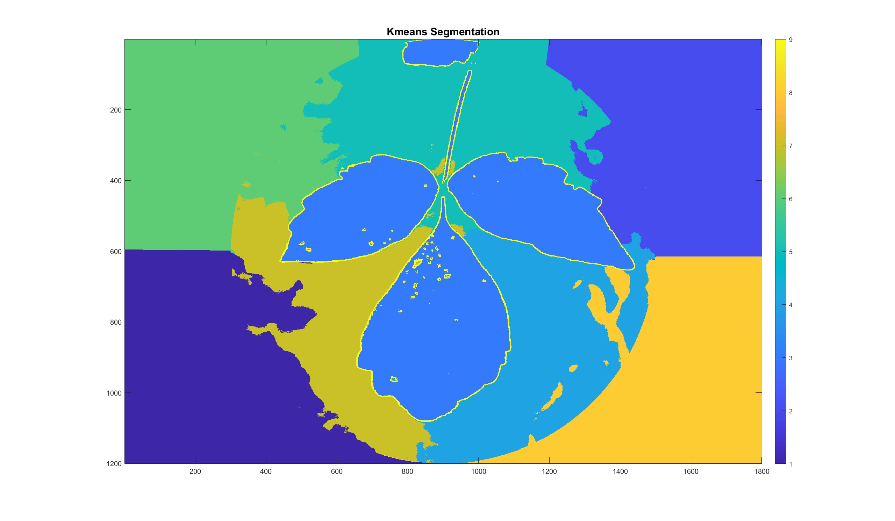

# Poison Ivy Detection via Semi-supervised Image Recognition

## Overview

This project tackles the problem of poison ivy detection via a semi-supervised image recognition algorithm in MATLAB. The aim of the project is to inform users if there is a poison ivy in a given picture. We used a combination of feature detection methods like CNN, corners and blob detection for classification. 

## Methodology
### Pre-processing: Initial Morphology and Noise Reduction

- First, the algorithm finds the ratio of the image dimensions and explores the colorspace for high-signal channels.
   

- A circular mask is generated to remove the area outside the circle.

- Image quantization is used to bucket the pixels of the image into 16 parts to further remove noise.

### Processing: Strong Edges

- Sobel edge detector is used to detect edges in vertical and horizontal directions.
- Edges with a magnitude above the 95th percentile are identified to achieve the strongest edges.

### Processing: K-Means and Noise Removal

- K-means is used for segmentation, multiple color channels are inputted into K-means.
- 5% weight for rows and columns, 200% weight for edge magnitudes, and a* from Lab are used for adjustments.
- Clusters for K-means are set to nine.

### Processing: Watershed Segmentation
- If K-means finds a single connected component of leaves, separate leafs with watershed segmentation
   

### Post-processing: Cleaning and Classifying
- Morphological operations are used to clean the image and prep for classifying algorithms to take over
- Classifying factors are: Number of leafs, number of corners, and neural network's output on the post-processed leaf image  

### How to use

Enter the `src` file for details on how to use. Read the "Final Report.pdf" for a more detailed explanation of the methodologies. 

### Results

Our algorithm has been tested on a set of images and was able to detect poison ivy with an accuracy of ~94%.

## Contributors
- Bardh Rushiti
- Mohd Junaid Shaikh
- Saksham Bansal